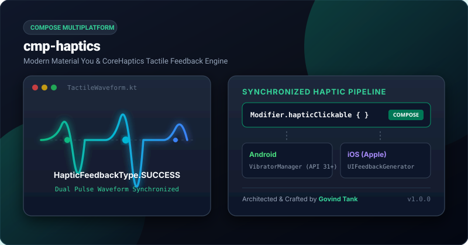

# cmp-haptics

<p align="center">
  <a href="https://jitpack.io/#govindtank/cmp-haptics"></a>
  <a href="https://github.com/govindtank/cmp-haptics/actions"></a>
  
  
  <a href="LICENSE"></a>
</p>

<p align="center">
  <b>Modern Haptic Feedback Engine for Compose Multiplatform (Material You &amp; CoreHaptics Sync).</b>
</p>

<p align="center">
  
</p>

---

## ⚡ Why `cmp-haptics`?

Providing nuanced physical feedback is essential for premium mobile experiences. In Compose Multiplatform:
- **Android**: Modern devices utilize sophisticated Linear Resonant Actuators (LRA) via `VibratorManager` and predefined `VibrationEffect` constants (API 29/31+), while older devices require fallback waveforms.
- **iOS**: Uses Apple Taptic Engine via `UIImpactFeedbackGenerator`, `UISelectionFeedbackGenerator`, and `UINotificationFeedbackGenerator`.

`cmp-haptics` bridges both platforms into a **single synchronized tactile API**:
- 🎯 **Semantic Presets**: `CLICK`, `DOUBLE_CLICK`, `TICK`, `SELECTION`, `SUCCESS`, `WARNING`, `ERROR`.
- ⚡ **Physical Strengths**: `LIGHT_IMPACT`, `MEDIUM_IMPACT`, `HEAVY_IMPACT`, `RIGID_IMPACT`, `SOFT_IMPACT`.
- 🎛️ **Custom Vibration Waveforms**: Timings + amplitude control (`HapticPattern`).
- 🎨 **1-Line Compose Modifier**: Attach `.hapticClickable { }` to any composable.

---

## 📦 Installation

Add JitPack and the dependency to your `build.gradle.kts`:

```kotlin
repositories {
    maven { url = uri("https://jitpack.io") }
}

dependencies {
    implementation("com.github.govindtank:cmp-haptics:1.0.0")
}
```

---

## 🚀 Quick Start

### 1. Android Initialization (`MainActivity.kt`)

```kotlin
import android.os.Bundle
import androidx.activity.ComponentActivity
import androidx.activity.compose.setContent
import io.github.govindtank.haptics.hapticInit

class MainActivity : ComponentActivity() {
    override fun onCreate(savedInstanceState: Bundle?) {
        super.onCreate(savedInstanceState)
        hapticInit(this)

        setContent {
            App()
        }
    }
}
```

### 2. Compose UI Usage

```kotlin
import androidx.compose.foundation.layout.*
import androidx.compose.material3.*
import androidx.compose.runtime.*
import androidx.compose.ui.Modifier
import androidx.compose.ui.unit.dp
import io.github.govindtank.haptics.*

@Composable
fun HapticShowcaseScreen() {
    val hapticManager = rememberHapticManager()

    Column(modifier = Modifier.padding(16.dp)) {
        // 1. Direct Trigger via HapticManager
        Button(onClick = {
            hapticManager.perform(HapticFeedbackType.SUCCESS)
        }) {
            Text("Trigger Success Haptic")
        }

        Spacer(Modifier.height(8.dp))

        Button(onClick = {
            hapticManager.perform(HapticFeedbackType.HEAVY_IMPACT)
        }) {
            Text("Heavy Impact")
        }

        Spacer(Modifier.height(16.dp))

        // 2. Composable Modifier
        Card(
            modifier = Modifier.hapticClickable(type = HapticFeedbackType.SELECTION) {
                println("Card clicked with selection haptic!")
            }
        ) {
            Text("Interactive Card with Built-in Haptics", modifier = Modifier.padding(16.dp))
        }

        Spacer(Modifier.height(16.dp))

        // 3. Custom Waveform Pattern
        Button(onClick = {
            hapticManager.performPattern(
                HapticPattern(
                    timings = longArrayOf(0, 50, 50, 100),
                    amplitudes = intArrayOf(0, 150, 0, 255)
                )
            )
        }) {
            Text("Custom Waveform Pattern")
        }
    }
}
```

---

## 🎯 Semantic Haptic Mapping Matrix

| Preset | Android System Action | iOS UIKit / CoreHaptics Engine |
| :--- | :--- | :--- |
| `CLICK` | `VibrationEffect.EFFECT_CLICK` | `UIImpactFeedbackGenerator(Medium)` |
| `DOUBLE_CLICK` | `VibrationEffect.EFFECT_DOUBLE_CLICK` | Dual `UIImpactFeedbackGenerator` |
| `TICK` / `SELECTION` | `VibrationEffect.EFFECT_TICK` | `UISelectionFeedbackGenerator` |
| `LIGHT_IMPACT` | Quick 15ms pulse (amplitude 100) | `UIImpactFeedbackGenerator(Light)` |
| `MEDIUM_IMPACT` | 30ms pulse (amplitude 180) | `UIImpactFeedbackGenerator(Medium)` |
| `HEAVY_IMPACT` | `VibrationEffect.EFFECT_HEAVY_CLICK` (50ms) | `UIImpactFeedbackGenerator(Heavy)` |
| `RIGID_IMPACT` | Sharp 25ms pulse (amplitude 240) | `UIImpactFeedbackGenerator(Rigid)` |
| `SOFT_IMPACT` | Subtle 20ms pulse (amplitude 80) | `UIImpactFeedbackGenerator(Soft)` |
| `SUCCESS` | Synchronized 2-pulse status wave | `UINotificationFeedbackGenerator(Success)` |
| `WARNING` | Synchronized 2-pulse status wave | `UINotificationFeedbackGenerator(Warning)` |
| `ERROR` | Synchronized 3-pulse urgent wave | `UINotificationFeedbackGenerator(Error)` |

---

## 🔒 Android Permissions

Add the vibration permission in your app's `AndroidManifest.xml`:

```xml
<uses-permission android:name="android.permission.VIBRATE" />
```

---

## 💖 Support the Project

If you find this project useful, consider supporting its active maintenance and future development:

<p align="left">
  <a href="https://buymeacoffee.com/govindtanko"></a>
  <a href="https://github.com/sponsors/govindtank"></a>
  <a href="https://www.patreon.com/govindtank"></a>
</p>

---

## 📄 License

This project is licensed under the Apache License 2.0 - see the [LICENSE](LICENSE) file for details.

*Maintained with ❤️ by [Govind Tank](https://github.com/govindtank).*
